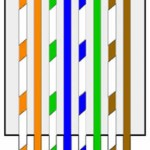

I purchased a Baytech RPC-3 Remote Power Controller from ebay and needed to set the IP information.  After reading the article from Altered Realms ([http://www.copyerror.com/2014/04/25/baytech-rpc3-remote-power-controller/](http://www.copyerror.com/2014/04/25/baytech-rpc3-remote-power-controller/){:target="_blank"}) I was still having trouble connecting to the serial port.  After some studying of the user manual ([http://www.baytech.net/downloads/manuals/U140E125-01\_rpc.pdf](http://www.baytech.net/downloads/manuals/U140E125-01_rpc.pdf){:target="_blank"}) I realized that you need a “Rollover” RJ45 cable.  This is NOT a standard cross-over cable but luckily can be easily made by cutting a standard patch cable and twisting the following pairs together (1-8,2-7,3-6,4-5,5-4,6-3,7-2,8-1):

- Light Orange / Brown
- Orange / Light Brown
- Light-Green / Green
- Blue / Light-Blue
- Light-Blue / Blue
- Green / Light-Green
- Light-Brown / Orange
- Brown / Light-Orange

Once I hooked this up with the Female DB9 (9FRJ45PC-1) as per the image below…we were good to go.

The final connection should look like this:

[Baytech RJ45 management port\] -> \[Rollover RJ45 cable\] -> \[9FRJ45PC-1\] -> \[Serial port on PC (or USB to Serial Adapter)\]
