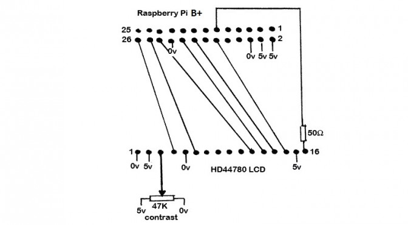

[](https://www.youtube.com/watch?v=TvvKoFj5pQ0){:target="_blank"}

Thanks to a great Python script from WiredCharlie ([LCD Player](http://forums.slimdevices.com/showthread.php?101269-piCorePlayer-%A32-LCD){:target="_blank"}), an amazing application from Triode ([Squeezelite](http://forums.slimdevices.com/showthread.php?97046-Announce-Squeezelite-a-small-headless-squeezeplay-emulator-for-linux-(alsa-only)){:target="_blank"}), and a small Linux build for the Raspberry Pi ([piCorePlayer](http://forums.slimdevices.com/showthread.php?97803-piCorePlayer-Squeezelite-on-Microcore-linux-An-embedded-OS-in-RAM-with-Squeezelite){:target="_blank"}); I am finally able to put together a squeezebox player for less than $50!

If you are not familiar with the squeezebox, it is a multi-room wireless music player that blows the doors off of Sonos and other competitive products. Unfortunately Logitech squashed the product, but luckily the community is keeping it alive! It is a amazing product that integrates with all major streaming services and also caters to the hifi user allowing for all forms of lossless and lossy audio formats.

**Step 1:** 
Purchase the following:
* Raspberry Pi B+ [$35.00](http://www.element14.com/community/community/raspberry-pi?CMP=KNC-PS-G-NA-RPI-BRND){:target="_blank"}

* 8GB SD Card [$8.00](http://www.amazon.com/Sandisk-MicroSDHC-Memory-Card-Adapter/dp/B000WH6H1M){:target="_blank"}

* HD44780 LCD Screen [$7.00](http://www.amazon.com/gp/product/B00FHSPES8){:target="_blank"} or if potentiometer to control the contrast is needed [$10.00](https://www.adafruit.com/product/181){:target="_blank"}

* Pack of resistors [$10.00](http://www.amazon.com/E-Projects-400-Piece-Value-Resistor/dp/B00E9Z0OCG){:target="_blank"}, you only need one 50ohm resistor)

**Step 2:** Wire up the LCD screen according to the schematic by WiredCharlie.  Notice you need the 47K potentiometer and 50ohm resistor in addition to the LCD:



**Step 3:** Load the following image from your machine on the SD card [Download](https://drive.google.com/file/d/0B-txOr6ZUTq5blI4RkQxNXF4ajg/view?usp=sharing){:target="_blank"}

You can copy the image using “dd” if in Linux or Win32diskimager if in windows ([Win32diskimager)](http://sourceforge.net/projects/win32diskimager/){:target="_blank"}.

**Step 4:** Now insert the SD card into your Pi, connect and ethernet cable and boot it up.  After about 30 seconds you can search for its IP address via your router DHCP leases.

**Step 5:** Now you can open a web browser and navigate to ‘http://IP-ADDRESS’ and then upgrade to the latest version of piCorePlayer by clicking the update button.

**Step 6:** After updating you will need to make some minor modifications to the LCD python script.  SSH into the IP of the Pi (username: **‘tc’** and password: **‘nosoup4u’**) and run the following commands:
```
sudo vi /opt/bootlocal.sh
```

Scroll down to a blank line….press the ‘i’ key, and then paste in the following:
```
sudo /mnt/mmcblk0p2/tce/readsq.py &
```
Now press the ‘esc’ key, then press ‘:’, then type ‘wq’ and press the enter key.  You should have saved the file and returned to the shell prompt.  Now run the following code to save the changes to the memory card:
```
sudo filetool.sh -b
```
Now finally edit the script to control the LCD screen:
```
sudo vi /mnt/mmcblk0p2/tce/readsq.py
```
Scroll down and comment out the following lines by inserting a ‘#’ in the front of the two lines of code (line ~1000 so use page down).
```
subprocess.Popen(\["/usr/local/etc/init.d/squeezelite\_initd", "stop"\])
subprocess.Popen(\["/usr/local/etc/init.d/squeezelite\_initd", "start"\])
```
Now save and exit as described above using the vi commands.  Finally reboot the Pi to execute the new code.

**Step 7(Optional):** If you decide to change the MAC address in the piCorePlayer Squeezelite GUI (so that you can spoof a real squeezebox player to listen to Pandora, etc.) you will need to edit the readsq.py script and change the following line of code.  This will read the new spoofed MAC instead of the hardware MAC address.
```
mac = subprocess.check\_output("grep -o -E '(\[\[:xdigit:\]\]{1,2}:){5}\[\[:xdigit:\]\]{1,2}' /usr/local/sbin/config.cfg", shell=True).upper().rstrip()
```
You should now have a working player with an active LCD screen.  Happy Listening!!!

 

\*\*\*Update:\*\*\*

Code for the readsq.py file to update other versions of piCorePlayer: [readsq.py](http://www.thesterk.com/wp-content/uploads/2015/01/readsq.py_.txt){:target="_blank"}
