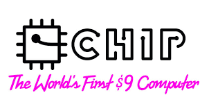

**I must say for $9.00 it could be the best LMS for the price**

Setup could not have been easier.  First unbox the device and connect it to a TV to setup the wireless and get the IP.

Next, SSH into the device to install everything else via command line:

ssh root@chip

Password:  chip

If you use a NAS or other network storage, you will need to enable the ability to mount remote shares.  You have to use a special kernel as by default you cannot do this with the default loaded software.  Luckily a user over on the next thing community board has already compiled a new kernel that includes everything you need.

Run the following:
```
cd /tmp wget http://www.raspibo.org/renzo/chiplinux4.3.0rd235+.tgz cd / sudo tar zxf /tmp/chiplinux4.3.0rd235+.tgz sudo cp /boot/vmlinuz-4.3.0rd235+ /boot/zImage

reboot

apt-get update

apt-get install cifs-utils

reboot
```
 

After the reboot lets test out that we can mount a network share:
```
sudo mkdir /storage

nano /etc/fstab
```

Scroll down to the first blank line and enter the follow (replacing your server and file path) and save and exit:
```
//<serverip>/<file path> /storage cifs username=guest,password=
```

Now lets test things out:
```
Mount -a
```

At this point you can try to browse to your files with the following:

```
cd /storage
```

If all is well there is one last step, installing LogitechMediaServer!

Install LMS:

See the latest version from this site:  [link](http://www.mysqueezebox.com/update/?version=7.9.0&revision=1&geturl=1&os=deb)

Now install the version from the URL above: 
```
cd /tmp wget "http://downloads.slimdevices.com/nightly/7.9/sc/7326393/logitechmediaserver\_7.9.0~1455784650\_all.deb"

dpkg -i logitechmediaserver\_7.9.0~1455784650\_all.deb
```

After the installation is complete you can visit LMS in a browser via the following URL:

```
http://chip:9000
```

Happy Listening!
