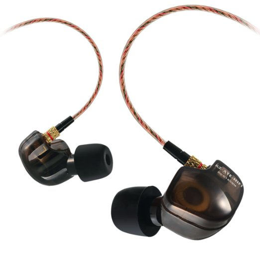

A friend of mine recently told me about an in ear headphone which costs $13.00 on Amazon, the KZ ATE IEM.  Being very into audio quality (pseudo audiophile), I was a huge sceptic.  After using  them for only a few days, I am completely blown away.  I can confirm, these are the best headphones you can purchase that will easily out perform other high quality popular brands that you know and love.  Do not hesitate, try them for yourself.

[link](https://www.amazon.com/KZ-Earphone-Headphones-Running-Microphone/dp/B00Y0F6IBG){:target="_blank"}
