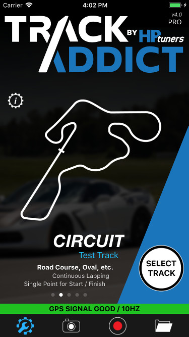
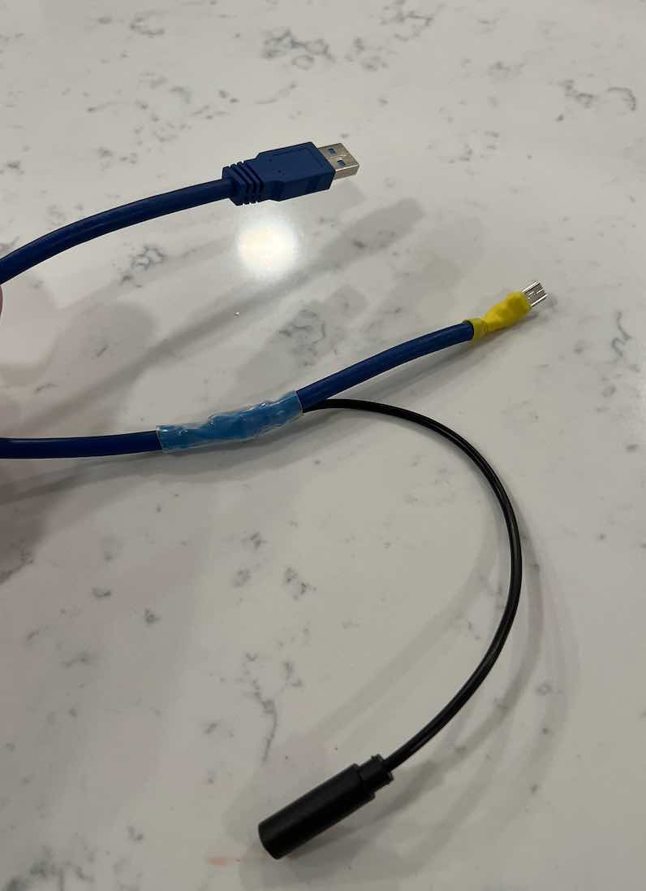
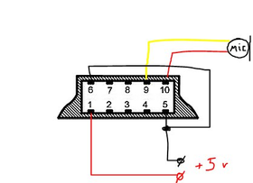
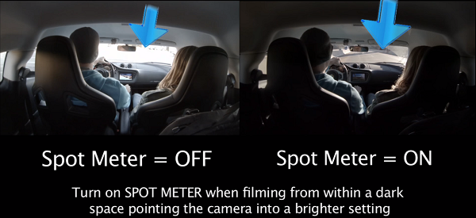

My High Performance Driving Video and Data Logging Setup.
{:style="color:gray;font-style:italic;font-size:90%;text-align:center;"}

# Overview

I have been interested in High Performacne Driving (HPDE) events since 2018.  I set out to find the best DIY setup for video/audio and data recording.  My requirements were fairly simple; a camera that had decent video (1080p/4k preferred), gyro stabilization, wifi, audio from an external mic, and the ability to charge without having to worry about battery constraints.  In addition, I wanted OBD engine data logging, and an external 16Hz GPS sensor for accurate track positioning.  After hours of research, I think I have found a recipe that works.  

**Hardware:**
* OBD BLE Data Reader [$40](https://www.amazon.com/gp/product/B073XKQQQW){:target="_blank"}
*  16Hz External GPS [$120](https://racebox.ecwid.com/Racebox-Pro-p136884742){:target="_blank"}
*  SCJAM SJ6 Legend [$125](https://www.bhphotovideo.com/c/product/1437113-REG/sjcam_sj6legend_sj6_legend_4k_action.html){:target="_blank"}

**Software:**
* Track Addict (iOS or Android) - [$9 for pro](https://racerender.com/TrackAddict/Features.html){:target="_blank"}
* RaceRender (post video, data sync software) [$60](https://racerender.com/RR3/Features.html){:target="_blank"}

**Accessories:**
* Combo SJ6 Charging/External Mic Cable [$20](https://shopee.ph/product/237542451/7620385048?smtt=0.266647243-1608439390.9){:target="_blank"}.  *This was not available for me to purchase without complicated forwarding shipping, so I ended up making my own.*  **More below...**
* USB cigarette lighter charging Port adapter [$20](https://www.amazon.com/Anker-Charger-PowerDrive-Adapter-iPhone/dp/B07PGT7LSR){:target="_blank"}
* Phone Mount [$15](https://www.amazon.com/gp/product/B00DJ5XH4O){:target="_blank"} and [$10](https://www.amazon.com/gp/product/B00WFNNNCC){:target="_blank"}.  This thing is solid and strong as the more expensive RAM mounts.
* Lapel microphone [$12](https://www.amazon.com/PoP-voice-Professional-Microphone-Omnidirectional/dp/B016C4ZG74){:target="_blank"}
* Camera suction mount [$40](https://www.amazon.com/gp/product/B00F19Q7YI){:target="_blank"}
* Micro USB Card (64 gig) [$15](https://www.amazon.com/gp/product/B073JYVKNX){:target="_blank"}

## DIY Cable (Optional if you are unable to aquire the combo cable above)

-Note, this DIY assumes you understand basic wiring pinout and have the supplies & know how to solder.
* 10 pin usb cable [$10](https://www.amazon.com/gp/product/B06XG1J9CY){:target="_blank"}
* Microphone Jack Adapter [$10](https://www.amazon.com/gp/product/B07Y8JS4BS){:target="_blank"}
* Heatshrink wrap to tidy it all up [$5](https://www.amazon.com/gp/product/B01MFA3OFA){:target="_blank"}

To create the cable you want to cut and splice into the USB cable so that the mic and power pins are wired as shown below.  What I did was actually cut away the shilding at the mini USB side to confirm the wire color to pin assignment. Then about 6 inches from that mini USB plug, I cut the cable and spliced in the microphone jack adapter.  This allowed me to still use the USB A side to power the camera (no need to touch pin 1 and 5 as they are already correct).  

Essentially, you just want to find the colored wire from pin 9 and 10 and connect them to the headphone jack adapter red and black wires. Then find the colored wire from pin 6 and splice it into the colored wire connected to pin 5. After a little solder and heat wrap, the cable looks like this:

**Pinout and Instructions:**

*Pinout above is looking into the usb cable as your would hold it in your hand.*

- **1 = Vcc +5V (red) alredy connected to USB A side**
- 2 = data + (white), not in use
- 3 = data - (green), not in use
- 4 = not in use
- **5 = GND (black) already connected to USB A side
- 6 = PWM (connect pin 6 to GND Pin 5/Black with a splice)**
- 7 = not in use
- 8 = not in use
- **9 = GND (microphone jack) cut from USB A and wire into adapter
- 10 = Signal (microphone jack) cut from USB A and wire into adapter**

If you get background noise from the external microphone, just switch the wires at pin 9 and 10 as they maybe reversed.

> IMPORTANT:  The one thing you must remember is the camera must have the Gimbal setting turned off (or just reset the camera to defaults to be safe). I spent hours thinking my cable was faulty when it was just the Gimbal setting overriding the USB port detection. When your cable is plugged in you will see a "Busy" message as it switches to the external microphone.

Full details can be found at this [link](https://sjcam.com/community/threads/adding-powerbank-and-external-mic.2440/){:target="_blank"}

## Usage

The normal setup is faily straight forward.  Attach the camera to the suction mount and position inside the car.  Run the lapel mic to a place within the car cockpit (I usually clip it to a seatbelt or close to the floorboard).  Run the USB charging cables and tape all cords down (I use blue painters tape).  Plug in the OBD reader, mount the external GPS so that it has good visibilty to the sky, place the phone in your phone holder, and finally start the TrackAddict software and select your track.  The software will connect to your external 16Hz GPS (BLE), connect to your OBD reader (BLE) to gather data from the engine, and control the camera start and stop recording functions via wifi. 

>Once last gotcha with this camera.  Ensure you turn spot metering ON.  If you do not (like I mistakenly did), the inside footage of the car will be perfect, but anything outside the windshield will be just a white washout.

## Post Video Production

After your track session, you can sync the external USB video from the camera to the TrackAddict data using Race Render.  From this you will have examples like the below with data overlayed on top of the video.  Happy Tracking!

{:target="_blank"}