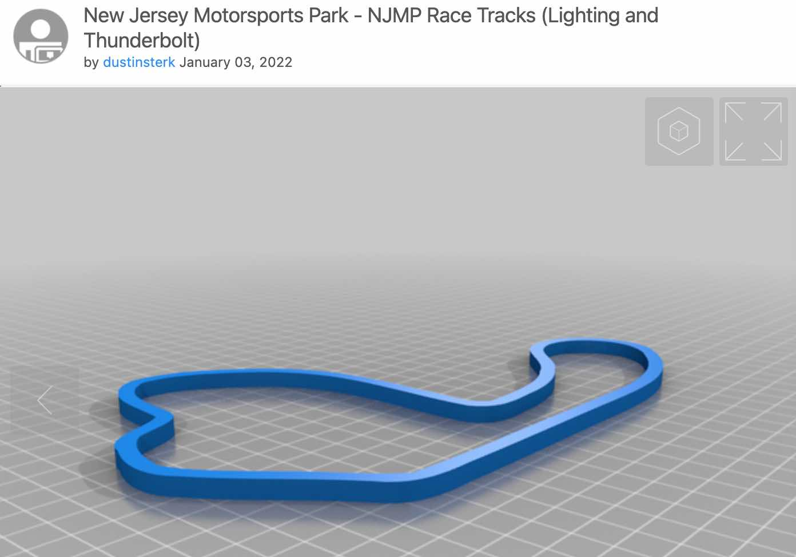

Creating and 3D Printing Track Maps
{:style="color:gray;font-style:italic;font-size:90%;text-align:center;"}

# Overview

I wanted to create some wall art of race tracks that I have driven or attended.  Some can be found from a quick search on [https://www.yeggi.com/](https://www.yeggi.com/){:target="_blank"} but others need to be created.

Since a local track was not available, I needed a way to outline the map, crate an .svg and import that into Ultimaker Cura for 3D printing.

> If you do not have a 3D printer, I highly recommend the [Ender3](https://www.creality.com/products/ender-3-v2-3d-printer-csco){:target="_blank"}.  You can find them on sale for under $200.

- First find the track online using Open Street Maps.  Here is an example of [NJMP](https://www.openstreetmap.org/search?query=new%20jersey%20motorsports%20park#map=15/39.3601/-75.0639){:target="_blank"}.
- Next click the share icon and export a SVG file that can be used in a vector editor like [Inkscape](https://inkscape.org/release/inkscape-1.2/){:target="_blank"}.
- Open the SVG file and either trace the track or select it with the clip tool and create a new SVG file.
- Convert the clean SVG file to an STL by using an online tool such as [this](https://svg2stl.com/).
- Finally import the STL into your 3D printing tool such as [UltimakerCura](https://ultimaker.com/software/ultimaker-cura){:target="_blank"}.
- Once printed I hung the traks on the wall using some 3M mounting putty such as [this](https://www.amazon.com/860-Scotch-Removable-Adhesive-Putty/dp/B018HSRGVC){:target="_blank"}.

**Enjoy!**