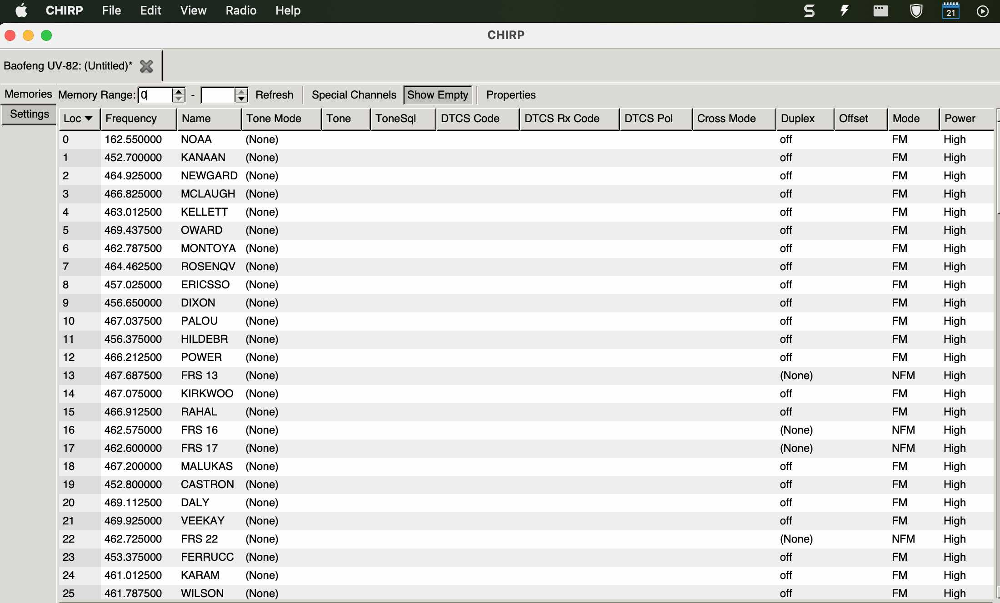

Radio fun with Motorsports!
{:style="color:gray;font-style:italic;font-size:90%;text-align:center;"}

# Overview

In preparation for the upcoming Indy 500, I decided to program my [BAOFENG UV-82](https://www.amazon.com/BaoFeng-UV-82-Two-Way-136-174MHz-400-520MHz/dp/B00E4KLY34){:target="_blank"} with the driver frequencies posted at the [Indy Motorspeedway Site](http://indymotorspeedway.com/scanner-freqs.html){:target="_blank"}.

There are many ways to program these cheap yet powerful radios, but I have found that [Chirp](https://chirp.danplanet.com/projects/chirp/wiki/Download){:target="_blank"} is a great tool!

After looking a bit further I also found a fellow radio enthusiast has created a preset CSV file you can use without any work for the upcoming 2022 race.  [Download](https://themann00.com/indy500-2022-v3/){:target="_blank"}

Do not forget ear protection and also a converter cable which allows a standard 3.5mm plug with your radio:
- [Honeywell Sync Stereo MP3 Earmuff](https://www.amazon.com/dp/B004U4A5RU){:target="_blank"}
- [Audio Jack Adapter Cable](https://www.amazon.com/dp/B071LJJ6VG){:target="_blank"}
