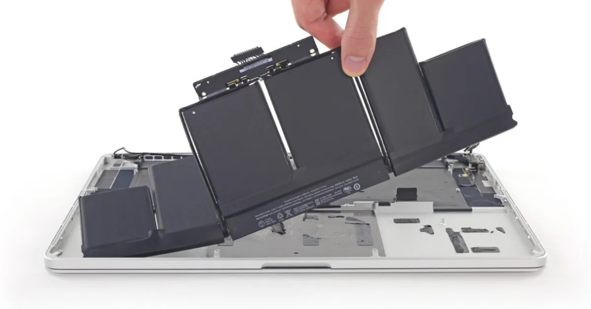

Useful when replacing your battery
{:style="color:gray;font-style:italic;font-size:90%;text-align:center;"}

# MacBook Battery Replacement
My trusty MacBook Pro from 2015 finally needed a battery replacement. Luckily with some preparation from [youtube](https://www.youtube.com/watch?v=d-LwyWh4x8w){:target="_blank"} and a [battery replacement kit](https://www.ifixit.com/Store/Mac/MacBook-Pro-15-Inch-Retina-Mid-2015-Battery/IF117-048?o=5){:target="_blank"} from ifixit, I was all set.  

I ran into one little issue.  I forgot to drain my laptop battery and needed a quick way to do so (This is *IMPORTANT* for safety reasons!).  After a little googling, I ran into this command which works wonders.  Execute the below code from the terminal and it will run and strain 2 cpu's at 99-100%.  My batter discharged in about 90 minutes.

```
yes > /dev/null & yes > /dev/null
```
