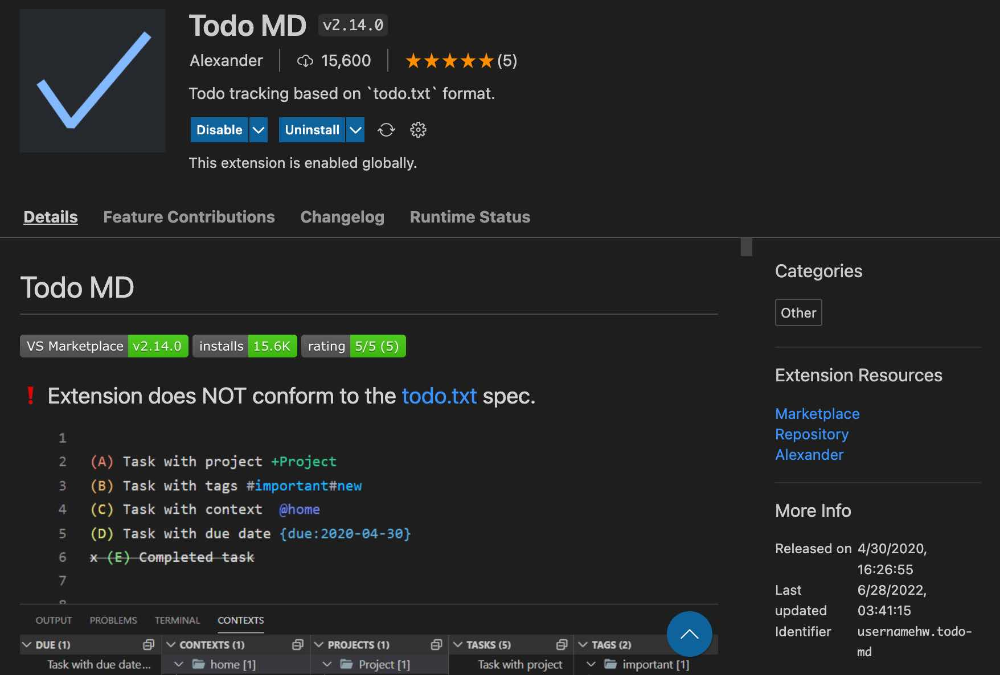
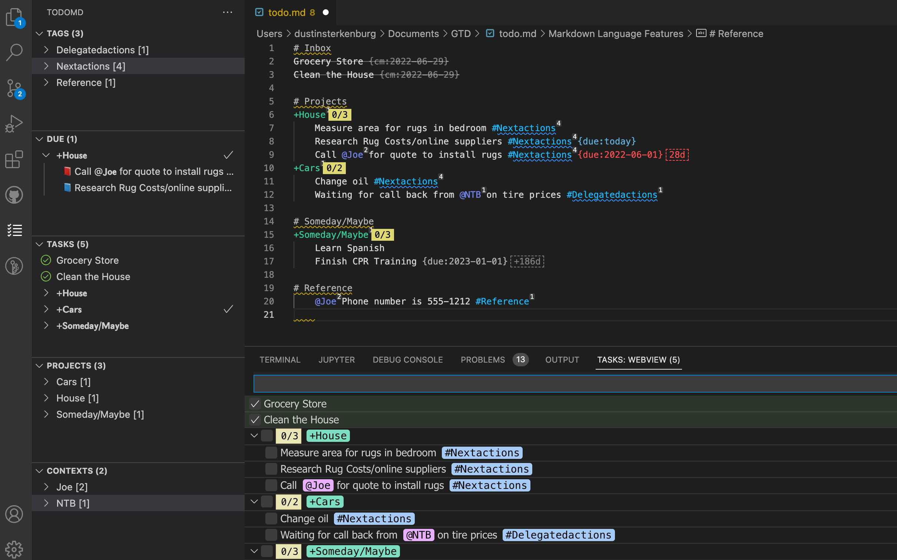

Using the Getting Things Done (GTD) method with simple text in VSCode
{:style="color:gray;font-style:italic;font-size:90%;text-align:center;"}

# Overview
I recently read [*Getting Things Done: The Art of Stress-Free Productivity by David Allen*](https://www.amazon.com/Getting-Things-Done-Stress-Free-Productivity/dp/0142000280){:target="_blank"} and wanted to put his method into action.  I love the idea of keeping it digital, but not purchasing or installing another app that I did not already use on a daily basis.  After much trial and error, I have landed on a plain text approach with a great plugin (TodoMD) all in my favorite IDE - Visual Studio Code.

## Setup
First, install [VSCode](https://code.visualstudio.com/download){:target="_blank"}.  Next, open the Extensions side menu and search for 'TodoMD' by the author 'usernamehw', then install it.  You can see the authors project [code](https://github.com/usernamehw/vscode-todo-md){:target="_blank"} here if you wish.  With this plugin installed, you can create a new file called 'todo.md' and select the TodoMD sidebar icon to see the magic happen.  

## Examples
I like to organize my text files based on the method taught in David's book.  This consists of an Inbox, Projects, Reference, Someday/Maybe, NextActions and DelegatedActions.  Using the TodoMD extension this allows me views of what is important and the ability to set due dates, cross off completed items, etc.

Using tab indentation (for parent/child nested items) and the special uses of the characters #, @, +, and '{due:YOURDATE}', the many views on the left and bottom allow for your action lists to be built dynamically.

Give it a try and let me know what you think!